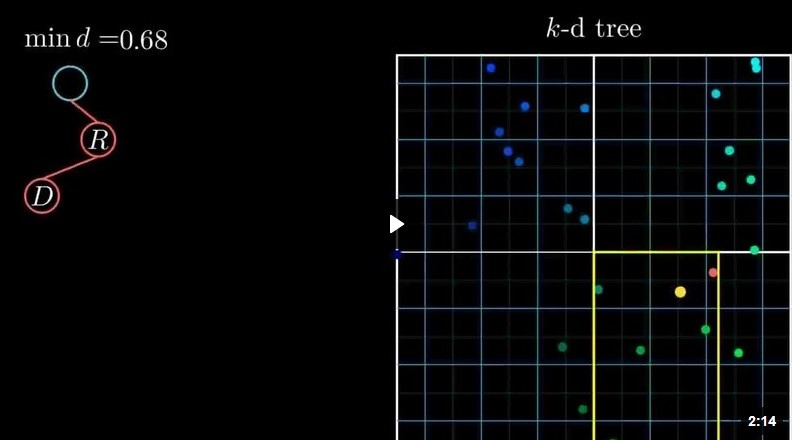

# kdtree

En ciencias de la computación, un Árbol kd (abreviatura de árbol k-dimensional) es una estructura de datos de particionado del espacio que organiza los puntos en un Espacio euclídeo de k dimensiones. Los árboles kd son un caso especial de los árboles BSP.

Un árbol kd emplea sólo planos perpendiculares a uno de los ejes del sistema de coordenadas. Esto difiere de los árboles BSP, donde los planos pueden ser arbitrarios. Además, todos los nodos de un árbol kd, desde el nodo raíz hasta los nodos hoja, almacenan un punto. Mientras tanto, en los árboles BSP son las hojas los únicos nodos que contienen puntos (u otras primitivas geométricas). Como consecuencia, cada plano debe pasar a través de uno de los puntos del árbol kd.

Técnicamente, la letra k se refiere al número de dimensiones. Un árbol kd tridimensional podría ser llamado un árbol 3d. Sin embargo se suele emplear la expresión "árbol kd tridimensional". (También es más descriptivo, ya que un árbol tridimensional puede ser varias cosas, pero el término árbol kd se refiere a un tipo en concreto de árbol de particionado.) Las letras k y d se escriben en minúsculas, incluso al principio de una oración. La k se escribe en cursiva, aunque son también comunes las formas "árbol KD" y "árbol Kd".

Usos de un árbol kd

En esta animación se representa como se busca el punto más próximo a otro punto dado (marcado en rojo). Aquí, el árbol ya está construido, cada vértice corresponde a un rectángulo, cada rectángulo se divide en dos subrectángulos iguales, y las hojas corresponden a rectángulos que contienen un solo punto.
Implementación en CBR ( Razonamiento Basado En Casos)
Búsqueda ortogonal en un árbol kd
Usar un árbol kd para encontrar todos los puntos que se encuentran en un rectángulo determinado (o análogo de más dimensiones). Esta operación también se denomina rango de búsqueda ortogonal.

Determinar dónde evaluar una superficie

En las regresiones locales es común evaluar la superficie contenida directamente solo por los vértices del árbol kd e interpolar en algún punto. Este uso, reflejado en la imagen de arriba, busca asegurar que sólo se realizarán las evaluaciones directas necesarias. Como los árboles kd se "adaptan" al espacio, este método puede suministrar una excelente aproximación a las verdaderas superficies de regresión local. Si la aproximación es pobre, puede mejorarse con más subdivisiones.

Complejidad

- Construir un árbol kd estático a partir de n puntos es de O(nlogn).
- Insertar un nuevo punto en un árbol kd balanceado es de O(logn).
- Eliminar un punto de un árbol kd balanceado es de O(logn).

👉 https://josuemzx.github.io/kdtreeKnn/
